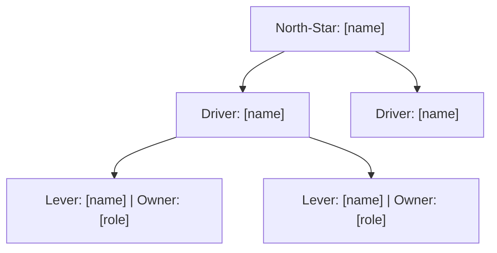

# KPI Tree Builder

A KPI tree is not a metrics list. It is a causal hierarchy — each node answers the question *"what, when moved, actually moves the node above it?"* This skill builds that tree from your business goal down to the leading indicators your team can act on daily, then stress-tests it against the four classic measurement failure modes before you commit resources to tracking it.

The output is owner-assigned, cadence-anchored, and measurement-readiness-audited — so every node either has an existing GA4/analytics source confirmed, or it is flagged for instrumentation before going live.

---

## Skills this calls

- **`brand-brain`** (required) — resolves the active brand's business context: acquisition model, revenue levers, ICP, and any already-stated north-star or OKR that constrains the tree. Fallback if brand-brain is absent or returns no brand: read `~/.brandbrain/brands/.active` + that brand's `brand.md` directly; if none exists, ask the user for the business model (SaaS / eCommerce / marketplace / other), primary revenue metric, and current analytics stack before proceeding.
- **`data-qa-measurement-gotcha-checker`** (required, gate step) — validates measurement claims before the tree is finalized; catches attribution window gaps, (not set) inflation, sampling, SRM, and self-referral noise that would corrupt metric reads at every node.
- **`ltv-cac-payback-calculator`** (compose when goal is acquisition/revenue) — use for LTV, CAC, and payback period math in the revenue branch rather than re-deriving formulas.
- **`channel-roi-scorecard`** (compose when tree has a paid/owned channel branch) — use for channel-level ROI nodes.
- **`growth-model-builder`** (reference) — if the user has run this already, its acquisition/retention loop map informs the tree structure; request the output if it exists.
- **`okr-suite`** (compose on request) — if the user wants OKR-to-KPI alignment, call this to translate objectives into key results before building the tree.
- **`looker-studio-live-dashboard-builder`** (optional, downstream) — once the tree is built, suggest this to wire the confirmed nodes into a live dashboard.
- **`analytics-report-reviewer`** (optional, downstream) — reviewer pass on the tree's measurement logic; invoke this separately, not inline.

---

## How a run works

```
Step 0  Load brand context   ──► call brand-brain (or fallback)
Step 1  Anchor the north-star ──► confirm or derive the single north-star metric
Step 2  Map the causal chain  ──► tier-1 drivers → tier-2 levers (Rockefeller Habits / Pirate + NSM framework)
Step 3  Assign + cadence      ──► owner per node, reporting cadence
Step 4  Measurement gate      ──► call data-qa-measurement-gotcha-checker; flag un-instrumented nodes
Step 5  Compose math nodes    ──► ltv-cac-payback-calculator / channel-roi-scorecard where relevant
Step 6  Output + save         ──► produce the tree artifact; save to ./kpi-trees/[slug]-kpi-tree.md
```

---

## Step 0 — Load brand context (always first)

Invoke the `brand-brain` skill (Skill tool, `skill: brand-brain`). Load the active brand's business model, revenue mechanics, ICP, and any existing OKRs or north-star language. This prevents the tree from being built on an assumed model (e.g., SaaS ARR tree for a transactional eCommerce brand).

**Fallback if brand-brain is absent or returns no brand:** read `~/.brandbrain/brands/.active` + that brand's `brand.md` directly; if none exists, ask the user for the business model (SaaS / eCommerce / marketplace / other), primary revenue metric, and current analytics stack before proceeding.

Do not begin tree construction until context is loaded.

---

## Step 1 — Anchor the north-star metric

The north-star metric (NSM) is the single number that best represents the value the product delivers to customers *and* predicts revenue. There is exactly one per tree.

**Derive it from the brand context if not stated.** Use the NSM framework heuristics:

| Business model | Common NSM candidates |
|---|---|
| SaaS / subscription | Weekly Active Accounts; seats with ≥N events/week; expansion MRR |
| eCommerce | Orders per active buyer per 90 days; Revenue per visitor |
| Marketplace | Successful transactions (both sides completed) |
| PLG / freemium | Time-to-first-value event; DAU/MAU ratio; PQL conversion rate |
| Content / media | Return visitors per month; engaged minutes per session |

**Gate:** if the user's stated goal is a revenue/growth number (e.g., "grow ARR to $5M"), confirm whether it is the NSM or a *consequence* of the NSM. NSM drives the goal; it is not the goal itself. Capture the distinction as a note on the root node.

Present the proposed NSM and ask for confirmation before building down.

---

## Step 2 — Map the causal chain (the tree)

Use the **Rockefeller Habits "KPI waterfall" + Pirate Metrics (AARRR) overlap** as the structural framework: every metric either lives in acquisition, activation, retention, referral, or revenue — and every child node is a causal antecedent (not a correlated indicator) of its parent.

**Tree depth:** three tiers is the target. Four is acceptable for complex revenue trees. More than four signals the scope is too broad — split into sub-trees per business unit or funnel stage.

```
NSM (root)
├── Tier-1 Driver A   ← direct causal lever of NSM
│   ├── Tier-2 Lever A1   ← operational metric owned by one team/person
│   └── Tier-2 Lever A2
├── Tier-1 Driver B
│   ├── Tier-2 Lever B1
│   └── Tier-2 Lever B2
└── Tier-1 Driver C
    └── Tier-2 Lever C1
```

**For each node, capture:**
- **Metric name** — precise, unambiguous (e.g., "Trial-to-paid conversion rate, 14-day window" not "conversion rate")
- **Definition** — numerator / denominator or event condition
- **Current baseline** — real number, or `[verify]` / "unknown — instrument first"
- **Target** — directional or specific; mark `[TBD]` if not set
- **Owner** — role or person; never "team"
- **Cadence** — daily / weekly / monthly
- **Data source** — GA4 event, CRM field, ESP metric, or `[not instrumented]`

**Causal vs. correlation check (apply to every parent–child pair):** ask "if Tier-2 node moves +10%, does Tier-1 node *necessarily* move in the same direction?" If no, demote to a monitoring metric and annotate the tree accordingly.

---

## Step 3 — Assign owners and cadence

Every tree node must have exactly one owner (a role, not a committee). Apply these defaults and adjust for the brand:

| Tier | Typical owner | Cadence |
|---|---|---|
| NSM | CEO / Head of Growth | Monthly |
| Tier-1 drivers | VP / Director of relevant function | Weekly |
| Tier-2 levers | IC / Specialist | Daily or weekly |

Surface any node with no plausible owner — it is either unmeasured, owned by no function, or a vanity metric that should be cut.

---

## Step 4 — Measurement readiness gate

**Invoke `data-qa-measurement-gotcha-checker`** before finalizing the tree. Pass the full node list with their stated data sources. This step gates the tree — do not output a "final" tree until it returns.

Apply the classic GA4/measurement failure modes as hard checks on every node:

| Gotcha | Check |
|---|---|
| Attribution window mismatch | Is the conversion window consistent across all acquisition nodes? |
| (not set) inflation | Does any node rely on a dimension prone to (not set) (landing page, channel grouping)? |
| Sampling | Any node pulling from a sampled GA4 property or BigQuery export with row limits? |
| Self-referral / hostname noise | Does any session-count node filter for the correct hostname(s)? |
| SRM (Sample Ratio Mismatch) | If the tree includes experiment nodes, is SRM detection in place? |
| Vanity-metric trap | Does any node measure activity (page views, impressions) with no causal link to a parent? |

Nodes that fail a check receive a `[⚠ measurement risk: <reason>]` annotation. The tree ships with the risk flags visible — do not silently remove them.

---

## Step 5 — Compose math nodes

When the tree includes LTV, CAC, or payback period nodes, **invoke `ltv-cac-payback-calculator`** rather than deriving the formulas inline. Pass the brand's revenue and cost inputs from Step 0.

When the tree includes a channel-ROI branch (paid search, paid social, email), **invoke `channel-roi-scorecard`** for the per-channel math. Fold the returned values into the relevant Tier-2 nodes.

If neither sibling is installed, derive the math inline using standard definitions (LTV = ARPU × gross margin % × average customer lifespan; CAC = total acquisition spend ÷ new customers acquired) — but note the derivation so a reviewer can verify.

---

## Step 6 — Output format and artifact

**Default format** — structured Markdown tree with the node table for each tier:

```markdown
## KPI Tree — [Brand] — [Goal / NSM] — [Date]

### North-Star Metric
| Metric | Definition | Baseline | Target | Owner | Cadence | Source |
| [NSM name] | ... | ... | ... | ... | Monthly | ... |

### Tier-1 Drivers
| Metric | Drives | Definition | Baseline | Target | Owner | Cadence | Source | Risks |

### Tier-2 Levers
| Metric | Drives | Definition | Baseline | Target | Owner | Cadence | Source | Risks |

### Monitoring Metrics (non-causal but tracked)
### Instrumentation Backlog (nodes flagged [not instrumented])
```

**Mermaid diagram** — produce on request (`mermaid`, "show me the tree", "diagram it"):



**Save the artifact** to `./kpi-trees/[brand-slug]-kpi-tree.md` (project-relative CWD). Never overwrite an existing tree without a version suffix or explicit user confirmation.

Suggest `looker-studio-live-dashboard-builder` as the next step once the tree is confirmed.

---

## Principles (Non-Negotiable)

- **Brand-brain first.** No tree before the active brand's business model and revenue mechanics are loaded.
- **One NSM.** Exactly one north-star metric per tree. Multiple NSMs signal a tree that covers multiple business units — split it.
- **Causal, not correlated.** Every parent–child relationship must pass the "+10% test." Correlates belong in the monitoring section, not the tree.
- **One owner per node.** Shared ownership is no ownership. If no single role can own a node, flag it.
- **Measurement gate is not optional.** `data-qa-measurement-gotcha-checker` runs before the tree is finalized. Risks are surfaced, never suppressed.
- **Compose math.** LTV/CAC/channel-ROI math delegates to sibling skills; no re-derivation.
- **Real baselines or `[verify]`.** Never invent a baseline. An unknown baseline is `[verify]` — and triggers an instrumentation backlog entry.

---

## What Not to Do

- Don't build the tree before brand-brain returns — the business model shapes which NSM is even valid.
- Don't treat a revenue goal (e.g., $5M ARR) as the NSM — it is the consequence; find the metric that drives it.
- Don't include more than four tiers; push for three. Depth beyond four is scope creep.
- Don't list correlates as children — activity metrics (page views, social followers) belong in monitoring, not the causal tree.
- Don't skip the measurement gate, and don't silently remove risk flags. A tree with hidden instrumentation gaps is worse than no tree.
- Don't assign ownership to "the team" or "marketing" — name a role.
- Don't re-derive LTV/CAC formulas inline when `ltv-cac-payback-calculator` is available.
- Don't overwrite an existing tree artifact without confirming with the user.

---

## Quality Checklist (self-review before presenting)

- [ ] `brand-brain` called and active brand's business model loaded (or fallback path taken)?
- [ ] Exactly one NSM, confirmed by the user before building down?
- [ ] Every parent–child pair passes the causal "+10% test"? Correlates demoted to monitoring?
- [ ] Every node has: precise definition, baseline (real or `[verify]`), owner (a role), cadence, and data source?
- [ ] `data-qa-measurement-gotcha-checker` invoked? All failing nodes annotated `[⚠ measurement risk: ...]`?
- [ ] LTV/CAC nodes compose `ltv-cac-payback-calculator`; channel-ROI nodes compose `channel-roi-scorecard`?
- [ ] Instrumentation backlog lists every `[not instrumented]` node?
- [ ] Artifact saved to `./kpi-trees/[brand-slug]-kpi-tree.md`?
- [ ] Mermaid diagram offered if not already requested?
